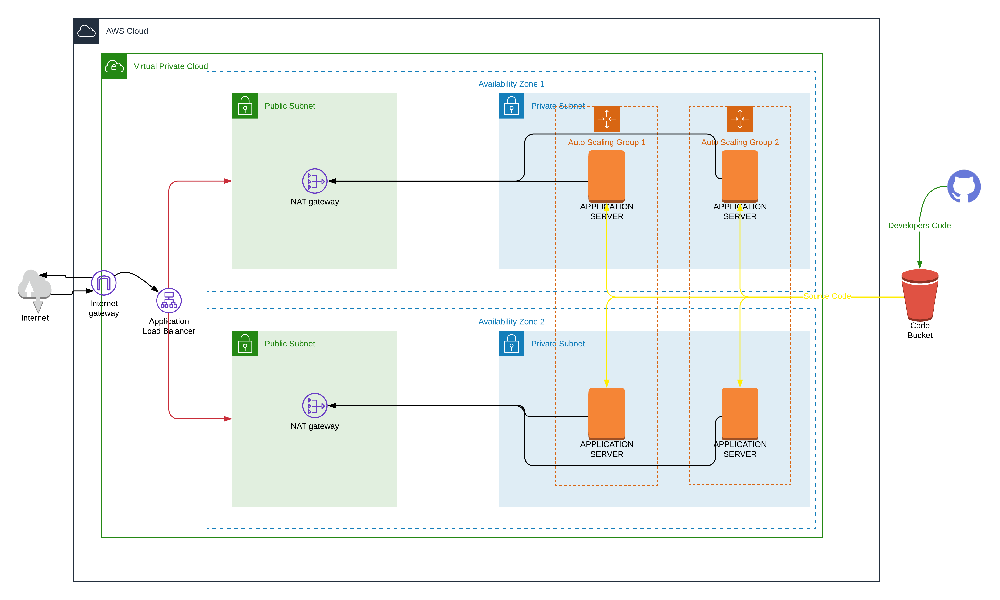

# Udacity Cloudformation HA-App
### Udacity Devops nanodegree project 2.
### Providing an AWS infrastructure to serve an high availability application using cloudformation.

**You can test the application via this link** : [http://appLoadBalancer-1404033071.eu-central-1.elb.amazonaws.com](http://appLoadBalancer-1404033071.eu-central-1.elb.amazonaws.com)

#### NOTE : Bastion Host was added and tested the connection to the private subnets successfully, But it was removed due to project criteria saying that ssh "KeyName" property shouldn't be in the production launch configuration. You can see the bastion host code through this repo commits history.

#### **Tasks Checklist**

##### **The Basics**

- [x] Parameters
	
- [x] Resources

- [x] Outputs

##### **Load Balancer**

- [x] Target Group
	
- [x] Health Check and Listener
	

##### **Auto-Scaling**

- [x] Subnets
	
- [x] Machine Specs
	
- [x] SSH Key
	

##### **Bonus**

- [x] Output
